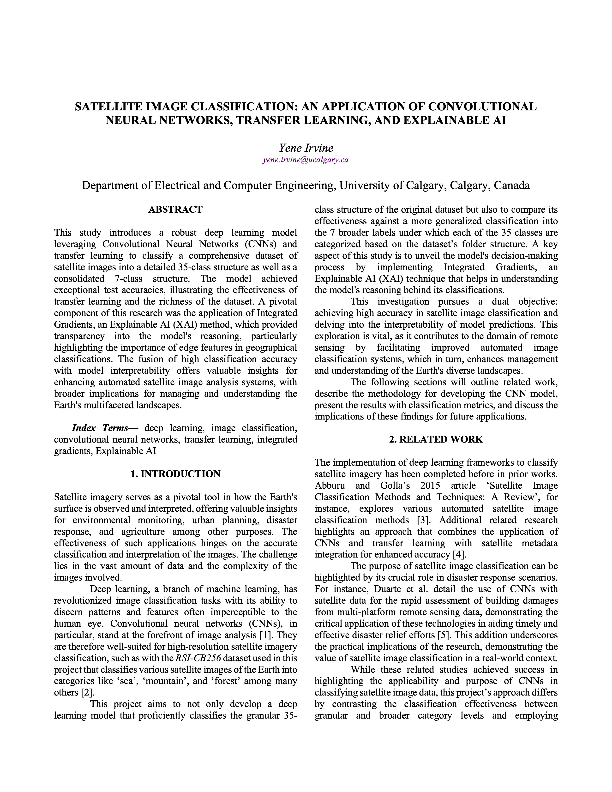
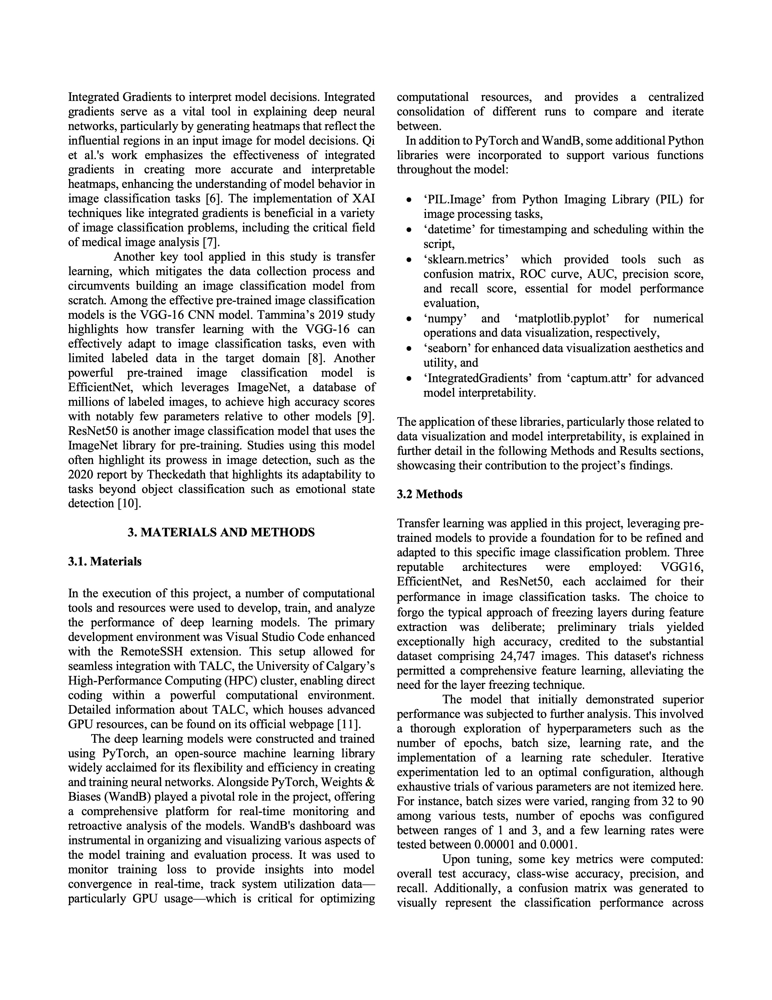
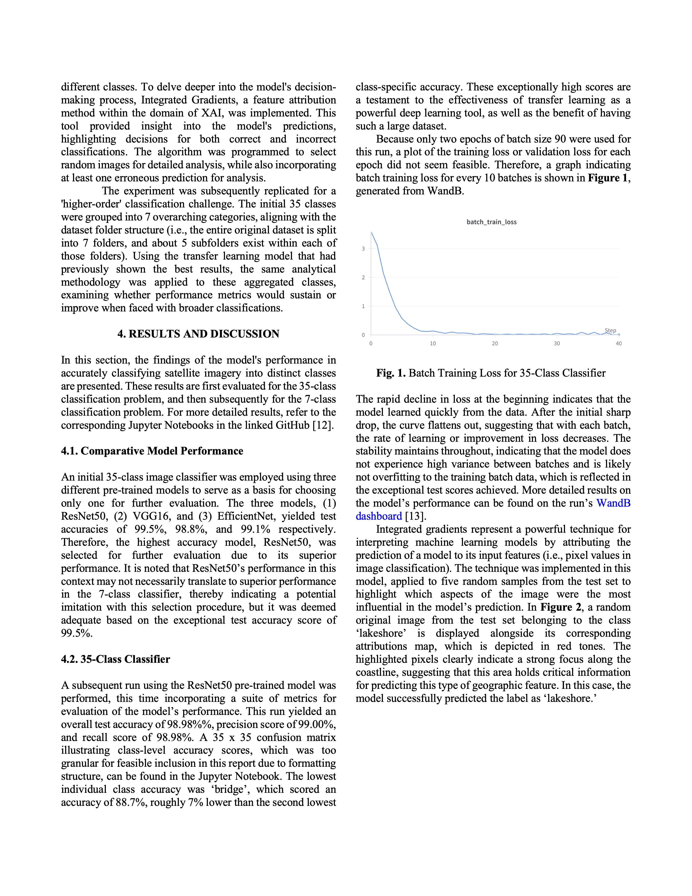
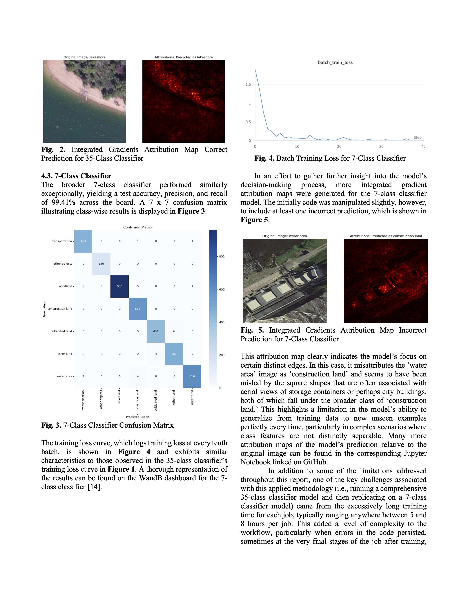
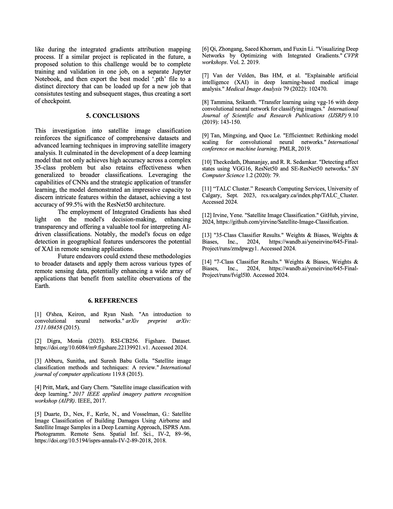

Note: # Both image classification models can be found on Google Drive (could not upload to GitHub due to file size limit):
https://drive.google.com/drive/folders/1H6Epfbe-EJdkYNWIMq4t5ad221tHED8E?usp=sharing

An application of Convolutional Neural Networks, Transfer Learning, and Explainable AI

📄 [View Full Report (PDF)](./Final-Report-645-YeneIrvine.pdf)
