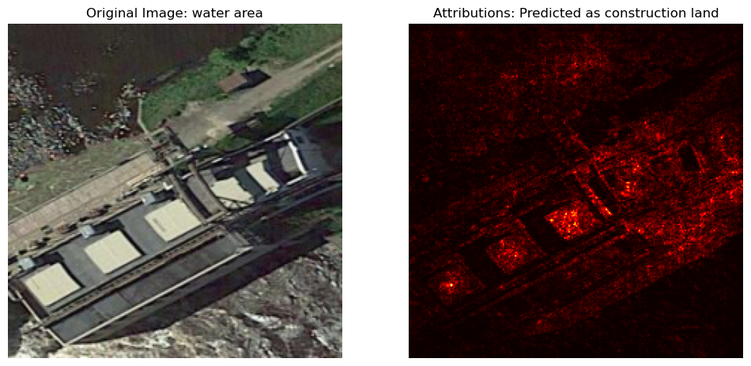
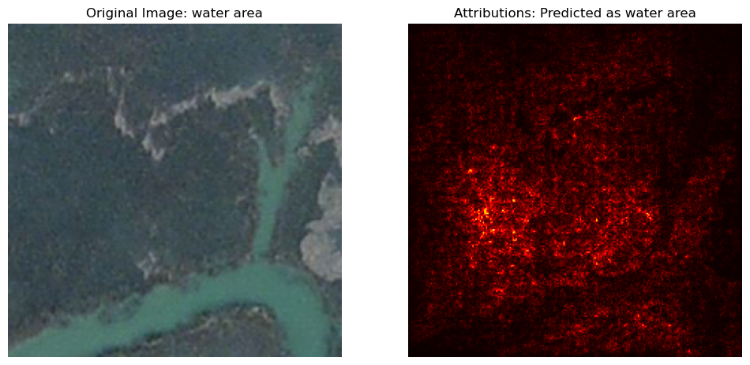
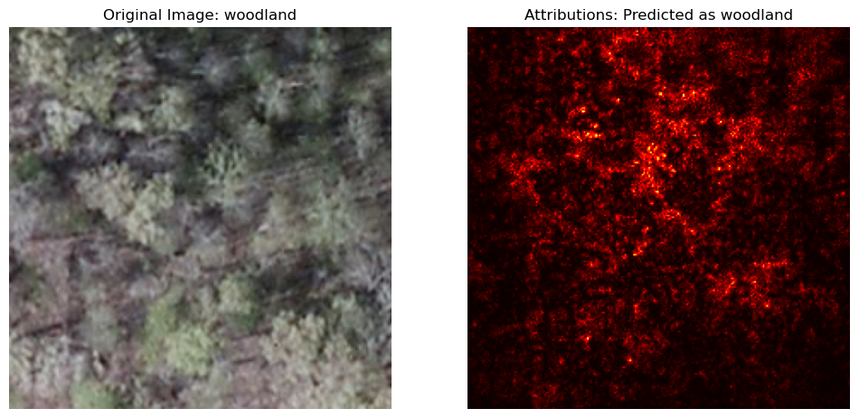
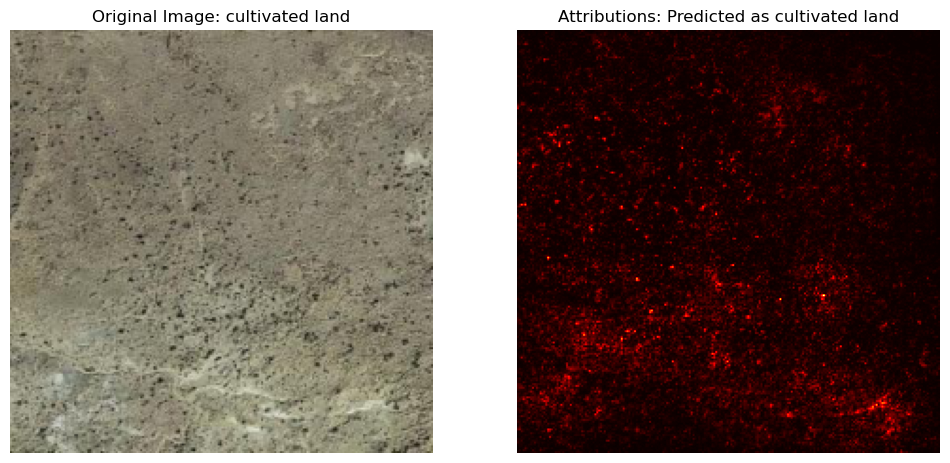

# Interpreting Deep Learning in Satellite Imagery 🌍🛰️  
**An Application of Explainable AI (XAI)**  

> **Full text available on my [ResearchGate profile](https://www.researchgate.net/publication/380999127_Satellite_Image_Classification_An_Application_of_Convolutional_Neural_Networks_Transfer_Learning_and_Explainable_AI_XAI#fullTextFileContent)** 
>
>  📄 or, [download the full report PDF](./Full-Report.pdf)

---

This project explores how deep learning models perceive satellite images—and how we can interpret those decisions using **Integrated Gradients**.  

By combining **CNNs**, **transfer learning**, and **XAI techniques**, the model classifies land types from aerial images and reveals *what it’s actually looking at* when it makes decisions.
> 🔍 For full methodology, background, model architecture, and discussion of results, see the [full report.](./Full-Report.pdf)

The final classifiers achieved:  
- **99.4% accuracy** on the 7-class general land type classifier  
- **99.5% accuracy** on the 35-class fine-grained classifier

---

## Example Visualizations

Below are examples of Integrated Gradients attributions for correctly and incorrectly classified satellite images.  
Brighter red areas show which pixels contributed most to the model’s prediction.

The **first image** below is an example of an incorrect classification by the model, of which there were very few (just 0.6% of the test set).

  
  
  
  

###  👉 More attribution map images from the test set, like the ones above, are available [here.](./gallery/gallery.md)

---

## Notebooks

Two models were developed and trained using the same XAI pipeline:

- 🏷️ [7-Class Classifier](./notebooks/7-Class-Classifier-cleaned.ipynb)  
  Groups satellite land types into general categories (e.g., *urban*, *water*, *woodland*)

- 🏷️ [35-Class Classifier](./notebooks/35-Class-Classifier-cleaned.ipynb)  
  A fine-grained classifier with detailed subcategories (e.g., *river*, *shrubland*, *ocean*)

---

## 🛠️ Tools & Libraries

- Python, PyTorch, torchvision
- Captum (for Integrated Gradients)
- WandB (for training logs & dashboard)
- scikit-learn, matplotlib, pandas
